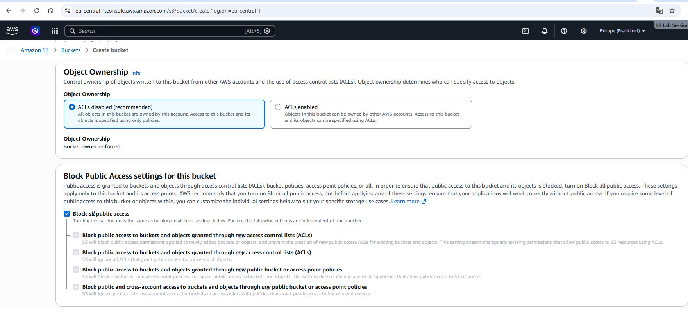
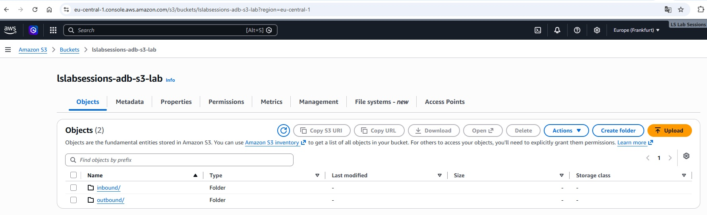
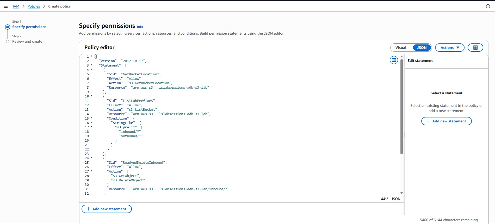

# AWS setup for the lab

The AWS side consists of one private general purpose S3 bucket, two prefixes, one customer-managed IAM policy, and one IAM principal used by the Autonomous Database credential.

## Bucket

The lab uses:

```text
Bucket: lslabsessions-adb-s3-lab
Region: eu-central-1 (Frankfurt)
```

The bucket was created as a **General purpose** bucket in the **shared global namespace**. AWS currently recommends the Account Regional namespace for new buckets because names remain reserved to the account. The shared global namespace was chosen here only to keep the lab bucket name and object URIs short and readable.

If you reproduce the lab, choose your own globally unique bucket name or use an Account Regional namespace bucket and update the scripts accordingly.

## Public access and ownership

The bucket uses:

```text
Object Ownership:       ACLs disabled / Bucket owner enforced
Block all public access: enabled
Versioning:             disabled for this lab
Default encryption:     SSE-S3
```

`Block all public access` prevents anonymous/public grants. It does **not** block authenticated access from an IAM identity whose policy authorizes the requested S3 action.



## Prefixes, not real directories

The console shows:

```text
inbound/
outbound/
```

S3 general purpose buckets have a flat object model. The console presents key prefixes as folders. The full key for a file such as `customer_20260823_001.csv` is therefore:

```text
inbound/customer_20260823_001.csv
```



## IAM policy

`iam-policy.json` grants only the permissions used by this lab.

`ListBucket` is a bucket-level action and is constrained to the two prefixes:

```text
inbound/*
outbound/*
```

Object-level permissions are separate:

```text
inbound/*  -> GetObject, DeleteObject
outbound/* -> GetObject, PutObject, DeleteObject
```

A new top-level prefix such as `archive/` would require a policy update. A nested prefix such as `inbound/archive/` is already covered by `inbound/*`.



## Access key

The reproducible lab path uses an IAM access key:

```text
AWS Access Key ID     -> DBMS_CLOUD credential username
AWS Secret Access Key -> DBMS_CLOUD credential password
```

Never commit either value to GitHub. The secret access key should never appear in screenshots.

For a production design, consider Oracle Autonomous Database support for AWS role/ARN-based access, which uses temporary AWS STS credentials instead of a long-lived IAM user secret.

## References

- AWS bucket namespaces: https://docs.aws.amazon.com/AmazonS3/latest/userguide/gpbucketnamespaces.html
- AWS bucket naming rules: https://docs.aws.amazon.com/AmazonS3/latest/userguide/bucketnamingrules.html
- AWS object keys: https://docs.aws.amazon.com/AmazonS3/latest/userguide/object-keys.html
- AWS folders: https://docs.aws.amazon.com/AmazonS3/latest/userguide/using-folders.html
- AWS Block Public Access: https://docs.aws.amazon.com/AmazonS3/latest/userguide/access-control-block-public-access.html
- Oracle AWS S3 loading: https://docs.oracle.com/en-us/iaas/autonomous-database-serverless/doc/autonomous-database-load-data-from-aws-s3.html
- Oracle AWS ARN access: https://docs.oracle.com/en-us/iaas/autonomous-database-serverless/doc/amazon-arn.html
