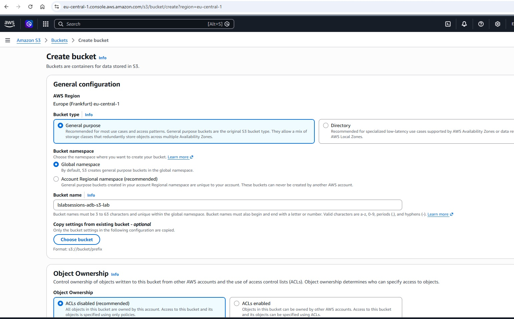
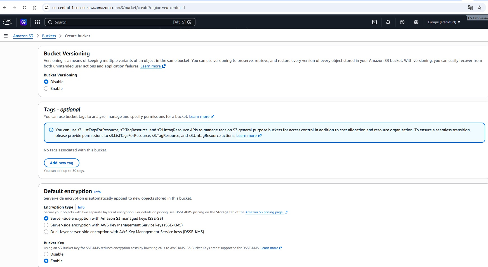
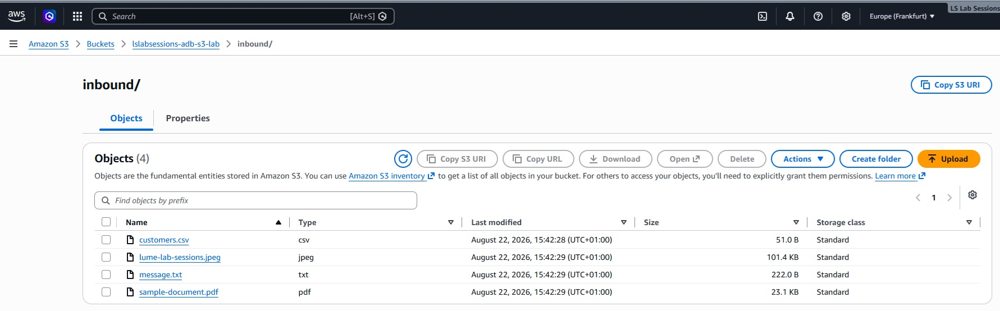
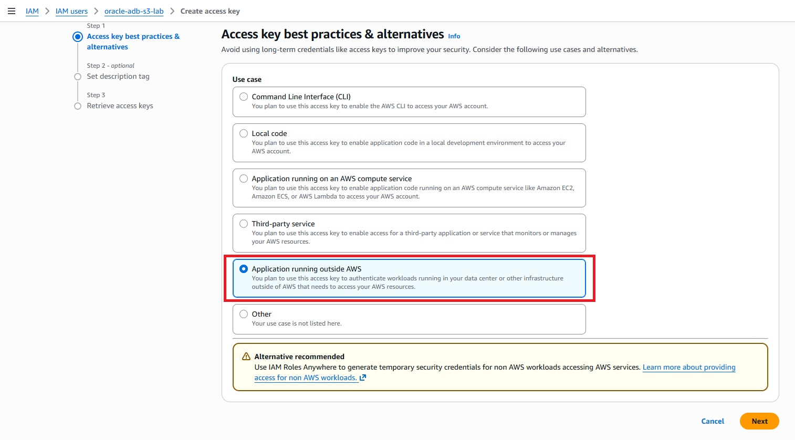

# AWS setup walkthrough

This document maps the AWS console setup to the screenshots captured during the lab.

## 1. Account and region

The lab used an AWS free account and selected **Europe (Frankfurt), `eu-central-1`**, matching the Autonomous Database region used for the exercise.

## 2. Create the S3 bucket

Core choices:

- General purpose bucket
- Shared global namespace for a shorter lab name
- `lslabsessions-adb-s3-lab`
- ACLs disabled / bucket owner enforced
- Block all public access enabled
- Versioning disabled for the lab
- SSE-S3 default encryption

Screenshots:






AWS recommends Account Regional namespace buckets for new production designs because only the owning account can ever create those names. The shared global namespace remains supported; this lab uses it only for compact URLs.

## 3. Create logical folders/prefixes

```text
inbound/
outbound/
```


These are S3 key prefixes, not filesystem directories. The console may create a zero-byte object ending in `/` to represent a folder visually.

## 4. Upload sample files

Initial inbound samples:

```text
customers.csv
lume-lab-sessions.jpeg
message.txt
sample-document.pdf
```



Later prefix tests add:

```text
customer_20260823_001.csv
customer_20260823_002.csv
customers-reordered.csv
orders_20260823_001.csv
```


## 5. Create the IAM policy

Use `aws/iam-policy.json` in the IAM JSON policy editor.


The policy implements least privilege for the lab. See [../aws/README.md](../aws/README.md).

## 6. Create the IAM user and access key

The user is created without console access and receives the customer-managed policy. The access key use case selected during the lab was **Application running outside AWS**, because Autonomous Database is not running as an AWS compute workload.



## 7. Store the AWS credential in Oracle

Run `sql/001-create-aws-credential.sql` from a local copy with the placeholders replaced.

Oracle maps:

```text
username -> AWS Access Key ID
password -> AWS Secret Access Key
```

The credential is then referenced by name (`AWS_S3_CRED`) in the remaining SQL.
