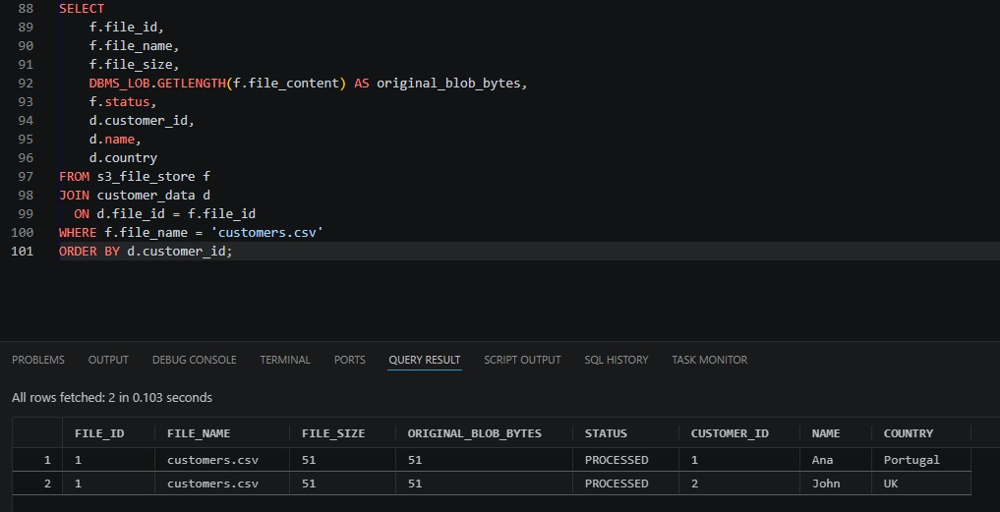
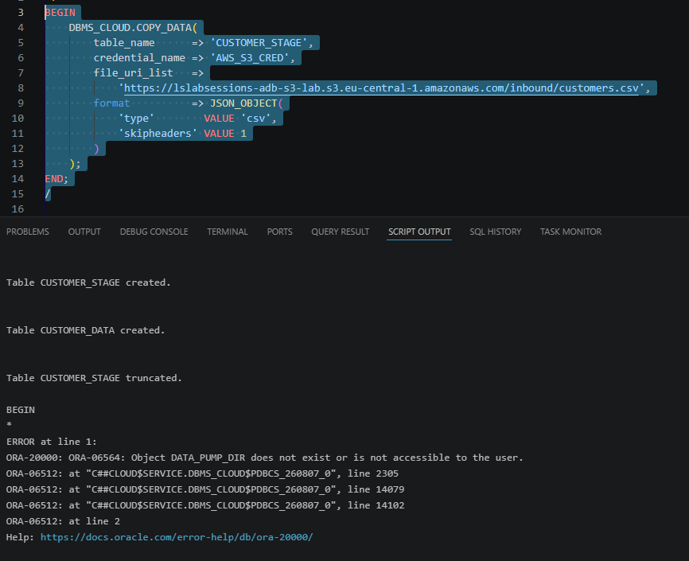
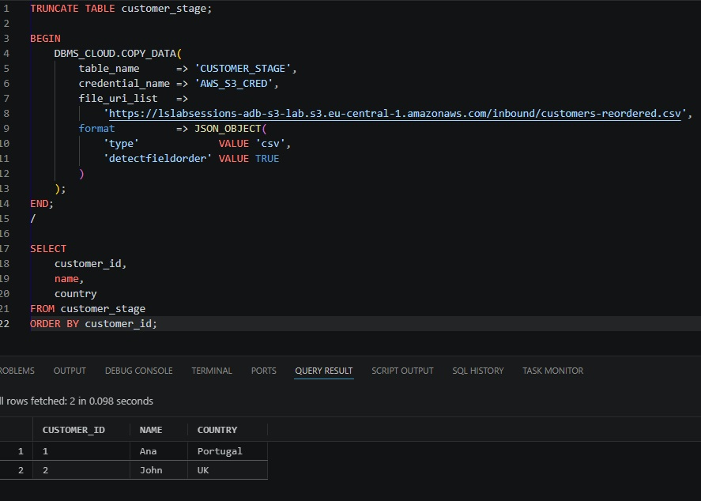
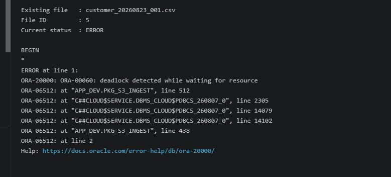

# COPY_DATA and CSV processing

`GET_OBJECT` and `COPY_DATA` solve different problems.

## GET_OBJECT vs COPY_DATA

```text
GET_OBJECT
S3 object -> BLOB
Use when the file itself matters: PDF, JPEG, ZIP, TXT, CSV archival, reprocessing.

COPY_DATA
S3 structured file -> Oracle table rows
Use when the goal is to load structured data into an existing table.
```

`COPY_DATA` does **not** persist the original source file in the database. The lab therefore preserves the source first with `GET_OBJECT`, then loads its rows with `COPY_DATA`.



## DATA_PUMP_DIR privilege

The first `COPY_DATA` attempt in the lab failed with:

```text
ORA-06564: Object DATA_PUMP_DIR does not exist or is not accessible to the user
```

Oracle documents `READ, WRITE` on `DATA_PUMP_DIR` as a minimum privilege for `COPY_DATA`, because load log/bad-file information is written there.



The prerequisite script contains:

```sql
GRANT READ, WRITE ON DIRECTORY DATA_PUMP_DIR TO <LAB_SCHEMA>;
```

## Header handling

There are three useful CSV cases.

### Header + positional mapping

Use `skipheaders = 1` when the first row is just a header to ignore and the remaining fields map positionally to the target table.

### Header + name-based mapping

Use:

```sql
'detectfieldorder' VALUE TRUE
```

when the first row contains field names and those names should be matched to Oracle columns. Oracle compares names case-insensitively.

The lab proves this with a reordered file:

```text
country,customer_id,name
Portugal,1,Ana
UK,2,John
```

while the Oracle table remains:

```text
CUSTOMER_ID | NAME | COUNTRY
```



With `detectfieldorder = true`, the first record is the field-name record; it is not loaded as a business row. The file therefore needs a valid header.

### No header

Do not use `detectfieldorder` when there is no header. Use positional mapping and do not skip the first row.

## Staging-table transaction lesson

During package development, this sequence caused `ORA-00060` in the lab:

```text
DELETE FROM customer_stage;
-- no commit
DBMS_CLOUD.COPY_DATA(... customer_stage ...);
```



Committing the staging cleanup before `COPY_DATA` resolved the lock conflict in this environment:

```sql
DELETE FROM customer_stage;
COMMIT;

DBMS_CLOUD.COPY_DATA(...);
```

This is documented here as a **lab observation and transaction/locking lesson**, not as a claim that every `COPY_DATA` execution universally requires a preceding commit.

## Concurrency note

`CUSTOMER_STAGE` is a shared regular table in this lab. A production design that permits concurrent ingestion jobs should isolate staging by run/session/file, or adopt a staging model designed explicitly for concurrency.

## Other structured formats

`COPY_DATA` is not limited to CSV; Oracle also documents support for formats such as Avro, ORC, and Parquet. This repository keeps CSV as the simple reproducible case.

## References

- DBMS_CLOUD format options: https://docs.oracle.com/en/cloud/paas/autonomous-database/serverless/adbsb/format-options.html
- DBMS_CLOUD subprograms: https://docs.oracle.com/en-us/iaas/autonomous-database-serverless/doc/dbms-cloud-subprograms.html
