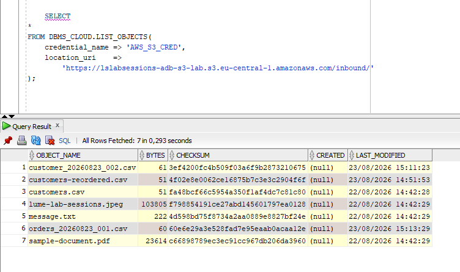

# S3 metadata and processing idempotency

This part of the lab answers several subtle questions about `OBJECT_KEY`, `CREATED`, `LAST_MODIFIED`, and `CHECKSUM`.

## `CREATED` vs `LAST_MODIFIED`

Oracle documents the following behavior for `DBMS_CLOUD.LIST_OBJECTS` with Amazon S3:

```text
CREATED       -> NULL
LAST_MODIFIED -> timestamp
```

This is visible in the lab result:



For a newly uploaded object, `LAST_MODIFIED` naturally looks like its creation/upload time. If the same key is overwritten later, `LAST_MODIFIED` changes to the later write time.

Do not build logic that expects `CREATED` to be populated for S3 through `LIST_OBJECTS`.

## What `CHECKSUM` means

Oracle documents the `LIST_OBJECTS.CHECKSUM` value as a 32-character MD5 checksum computed on object contents.

That means two different S3 objects can legitimately have the same checksum:

```text
inbound/a.csv       checksum = ABC...
outbound/copy.csv   checksum = ABC...
```

if their bytes are identical.

The checksum does **not** encode the object name, prefix, bucket, or timestamp.

Also avoid conflating this Oracle `CHECKSUM` field with the Amazon S3 ETag. AWS documents cases where an ETag is not an MD5 of the entire object, such as multipart uploads and some encryption modes.

## Why `OBJECT_KEY` is stored

Within a bucket, the S3 object key identifies the object. Prefixes shown as folders are part of the key:

```text
FILE_NAME  = customer_20260823_001.csv
OBJECT_KEY = inbound/customer_20260823_001.csv
```

The process needs `OBJECT_KEY` because `LAST_MODIFIED + CHECKSUM` alone does not tell us **which S3 object** produced the event.

Example:

```text
OBJECT_KEY                         LAST_MODIFIED          CHECKSUM
inbound/customer_001.csv          2026-08-25 10:00       ABC
inbound/customer_copy.csv         2026-08-25 10:00       ABC
```

Those are two different objects even if the upload times and contents happen to match.

## Why `OBJECT_KEY + CHECKSUM` is still not enough

A recurring feed may reuse the same object key:

```text
Day 1
OBJECT_KEY     inbound/customers.csv
LAST_MODIFIED  2026-08-25 08:00
CHECKSUM       ABC

Day 2
OBJECT_KEY     inbound/customers.csv
LAST_MODIFIED  2026-08-26 08:00
CHECKSUM       ABC
```

The content is equal, but the second upload can still be a new business delivery that must be processed.

## Lab idempotency key

The package therefore uses:

```text
BUCKET_NAME
+ OBJECT_KEY
+ LAST_MODIFIED
+ CHECKSUM
```

Each component answers a different question:

| Attribute | Purpose |
|---|---|
| `BUCKET_NAME` | Which S3 bucket? |
| `OBJECT_KEY` | Which object/path inside that bucket? |
| `LAST_MODIFIED` | Which observed write/delivery of that key? |
| `CHECKSUM` | Do the observed contents match? |

This is **processing idempotency**, not global content deduplication.

If the business rule were instead "never process the same bytes twice regardless of name or delivery time", the checksum would play a very different role.

## Production caveat

The combination above is appropriate for this non-versioned lab, but it is not presented as a universal immutable S3 event ID. If strict object-version identity is required, consider S3 Versioning/version identifiers, an upstream unique delivery ID, or a manifest/event model designed for that requirement.

## References

- Oracle `LIST_OBJECTS`: https://docs.oracle.com/en-us/iaas/autonomous-database-serverless/doc/dbms-cloud-subprograms.html
- AWS object keys: https://docs.aws.amazon.com/AmazonS3/latest/userguide/object-keys.html
- AWS upload integrity / ETag details: https://docs.aws.amazon.com/AmazonS3/latest/userguide/checking-object-integrity-upload.html
