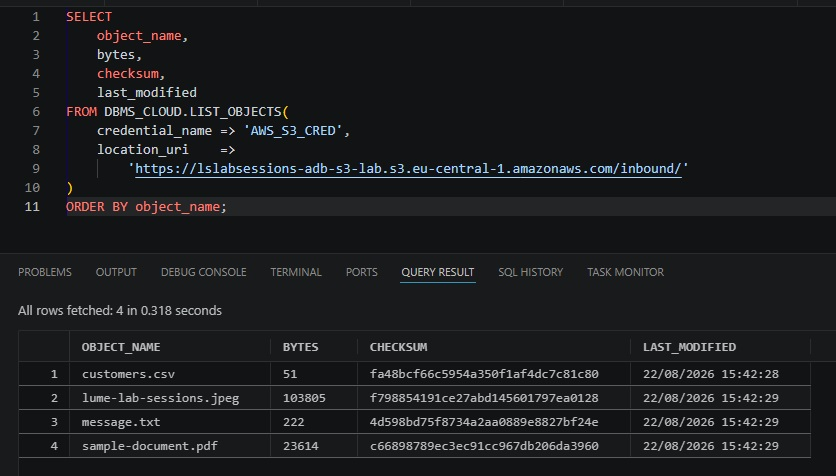
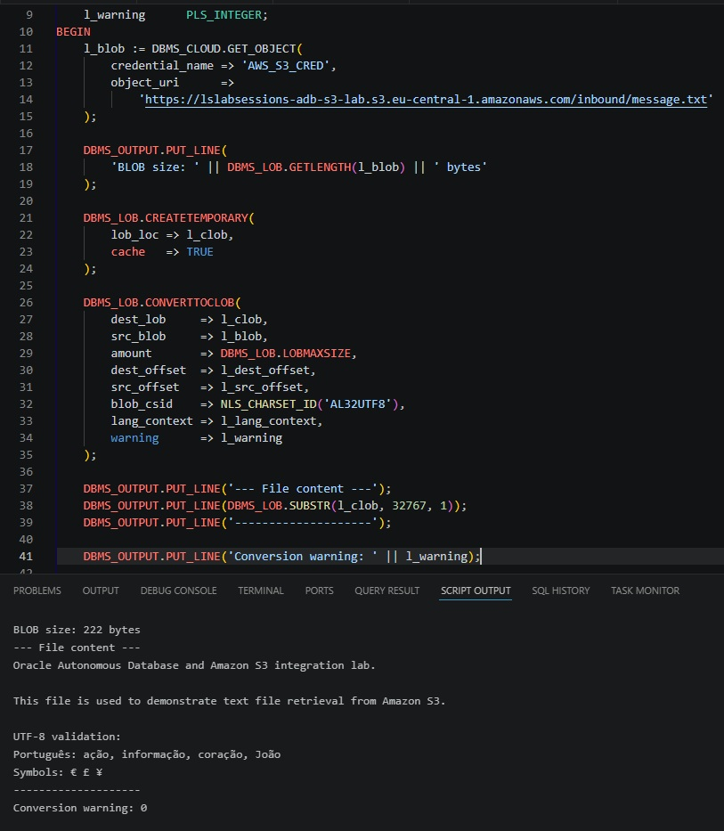
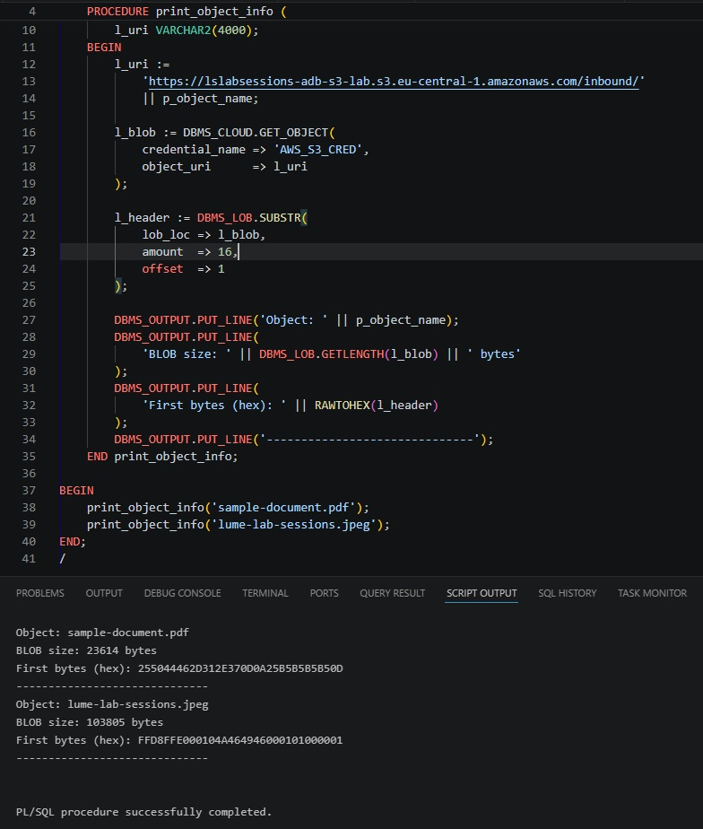
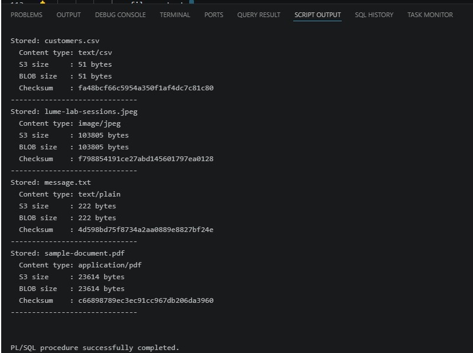
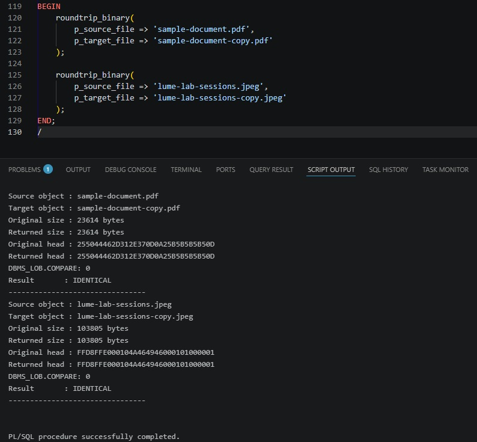
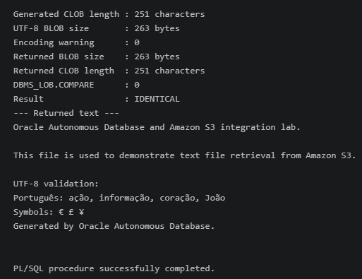
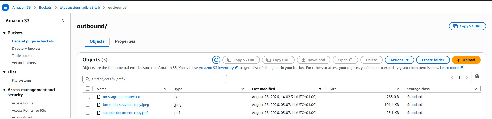

# DBMS_CLOUD object operations and LOB handling

## LIST_OBJECTS

`DBMS_CLOUD.LIST_OBJECTS` is used first to prove that the private S3 bucket can be reached with the stored credential.



The function can take a bucket URI, folder URI, or a URI containing `*` / `?` wildcards. This means both of these are valid patterns:

```text
.../inbound/
.../inbound/customer_*.csv
```

## GET_OBJECT: bytes first

`GET_OBJECT` retrieves an S3 object as a `BLOB`. S3 does not know about Oracle `BLOB` versus `CLOB`; it stores object bytes.

### Text

For `message.txt`, the lab explicitly decodes the original bytes as UTF-8:

```text
GET_OBJECT -> BLOB -> CONVERTTOCLOB(AL32UTF8) -> CLOB
```

The sample demonstrates why byte length and character length are different:

```text
BLOB size:  222 bytes
CLOB length: 210 characters
```

Characters such as `ã`, `ç`, `€`, `£`, and `¥` require multiple bytes in UTF-8.



### Binary file signatures

For binary objects, no character conversion is performed. The lab inspects the first 16 bytes:

```text
PDF:  25504446...        -> %PDF
JPEG: FFD8FFE0...        -> JPEG start, followed by JFIF in the sample
```



This verifies the actual file signature rather than relying on `.pdf` or `.jpeg` alone.

## Persisting the source object

All source files, including TXT and CSV, are stored in `S3_FILE_STORE.FILE_CONTENT` as the original BLOB.



This gives the database an immutable source copy from which text/business representations can be derived.

## PUT_OBJECT and binary integrity

The PDF and JPEG are read from the database, uploaded to `outbound/`, read back, and compared:

```text
Oracle BLOB -> PUT_OBJECT -> S3 -> GET_OBJECT -> BLOB
                                       |
                                       v
                              DBMS_LOB.COMPARE
```

A return value of `0` means the compared LOB content is identical.



## Text round-trip

The text test performs both directions explicitly:

```text
CLOB -> CONVERTTOBLOB(AL32UTF8) -> PUT_OBJECT
S3   -> GET_OBJECT -> CONVERTTOCLOB(AL32UTF8) -> CLOB
```

The returned CLOB is then compared with the generated CLOB.





## DELETE_OBJECT

`DELETE_OBJECT` is used only after database persistence and processing succeed. The package keeps source deletion as a separate state transition so a failed external delete can be retried without reloading the business data.
