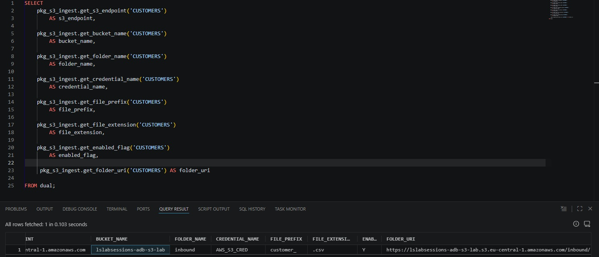
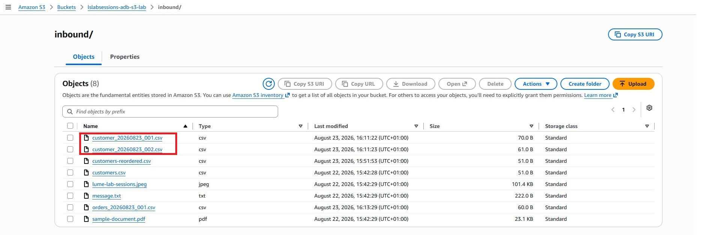
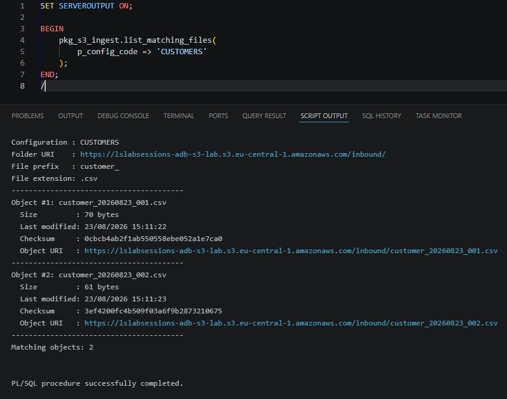
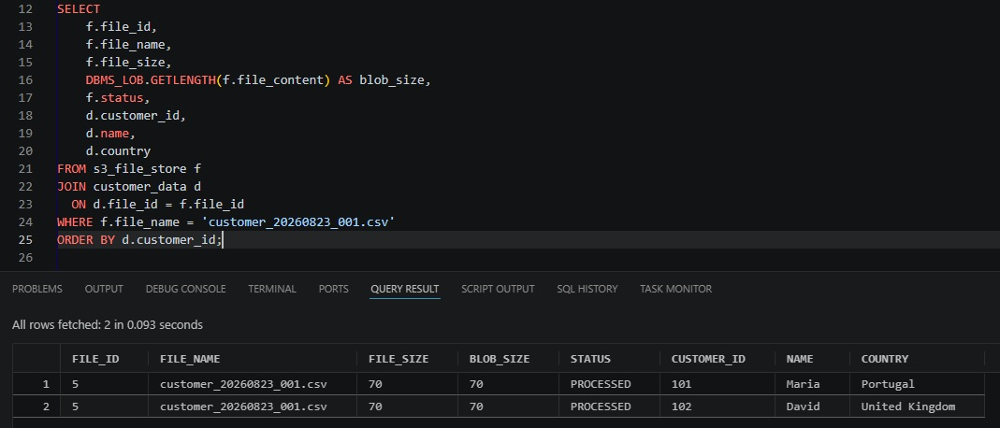
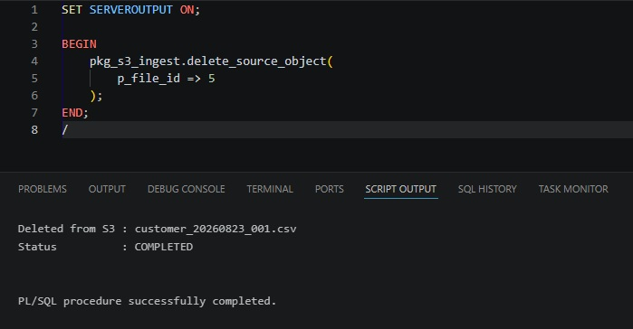
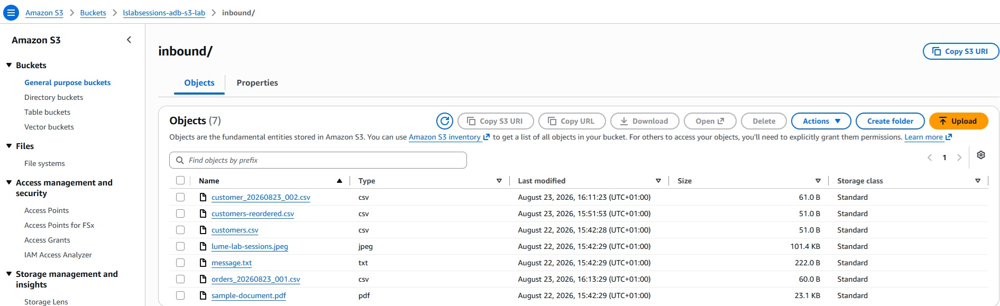
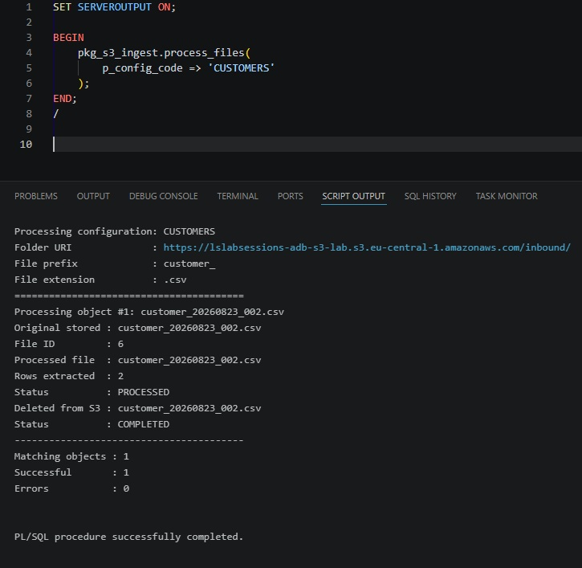
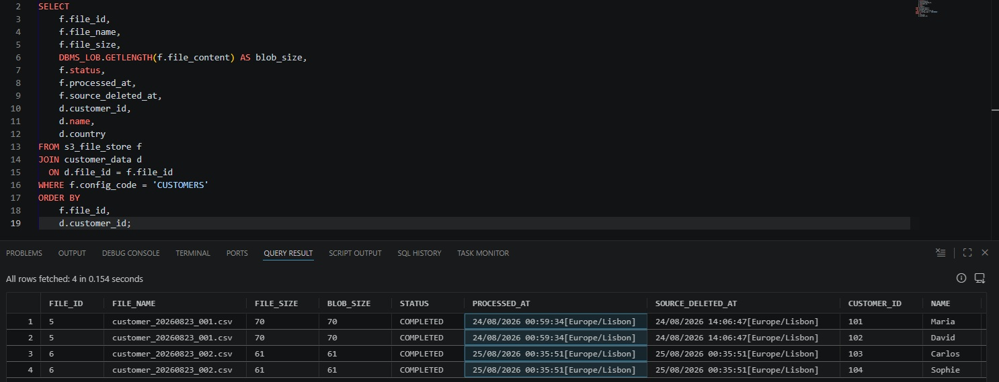
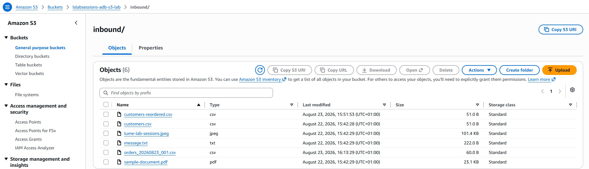

# Parameterized prefix-based ingestion

The final exercise converts the individual operations into a reusable PL/SQL package.

## Configuration table

`S3_INGEST_CONFIG` stores:

```text
CONFIG_CODE
S3_ENDPOINT
BUCKET_NAME
FOLDER_NAME
CREDENTIAL_NAME
FILE_PREFIX
FILE_EXTENSION
ENABLED_FLAG
```

For the sample feed:

```text
CUSTOMERS
s3.eu-central-1.amazonaws.com
lslabsessions-adb-s3-lab
inbound
AWS_S3_CRED
customer_
.csv
Y
```



## Individual property functions

The package deliberately exposes one function per configuration property:

```text
GET_S3_ENDPOINT
GET_BUCKET_NAME
GET_FOLDER_NAME
GET_CREDENTIAL_NAME
GET_FILE_PREFIX
GET_FILE_EXTENSION
GET_ENABLED_FLAG
GET_FOLDER_URI
GET_OBJECT_URI
```

This keeps configuration access explicit and testable.

## Prefix discovery

The folder can contain many unrelated objects, but the feed selects only names beginning literally with `customer_` and ending in `.csv`.





The package uses `SUBSTR` for a literal prefix comparison. This avoids a subtle bug with SQL `LIKE`: `_` is a one-character wildcard in `LIKE`, so `LIKE 'customer_%'` does not mean a literal underscore.

As an alternative, `DBMS_CLOUD.LIST_OBJECTS` supports `*` and `?` wildcards directly in `location_uri`. The test script includes:

```text
.../inbound/customer_*.csv
```

In that URI wildcard syntax, `_` is literal.

## PROCESS_FILE

The final `PROCESS_FILE` implementation handles one object end to end:

```text
read S3 metadata
     ↓
check same observed occurrence
     ↓
GET_OBJECT
     ↓
persist original BLOB + COMMIT
     ↓
PROCESSING
     ↓
COPY_DATA
     ↓
CUSTOMER_DATA + FILE_ID
     ↓
PROCESSED + COMMIT
     ↓
DELETE_SOURCE_OBJECT
     ↓
COMPLETED / DELETE_PENDING
```

During construction of the lab, processing and deletion were first tested separately. That is why the screenshots below show a `PROCESSED` state before the explicit delete test. In the final package, the same safe-delete routine is called automatically after successful processing.



## DELETE_SOURCE_OBJECT

A source can only be removed in `PROCESSED` or `DELETE_PENDING` state.

```text
PROCESSED
   ↓
DELETE_OBJECT
   ├── success -> COMPLETED
   └── failure -> DELETE_PENDING
```





## PROCESS_FILES

`PROCESS_FILES('CUSTOMERS')` is the production-style entry point in the lab. It discovers every currently matching object and calls `PROCESS_FILE`; the final `PROCESS_FILE` implementation performs the safe source deletion after the database work is committed.



The package catches errors per file so one bad object does not automatically prevent later matching objects from being attempted.

## Final result

The database contains both source BLOBs and extracted business rows:



The two `customer_...` source objects are gone from S3, while unrelated files remain:



## State model

| State | Meaning |
|---|---|
| `RECEIVED` | Original BLOB has been persisted |
| `PROCESSING` | Business extraction is in progress |
| `PROCESSED` | Original + business rows are committed |
| `DELETE_PENDING` | Database work is complete, but S3 deletion must be retried |
| `COMPLETED` | Database work completed and source was deleted from S3 |
| `ERROR` | Database processing failed; source should remain available |

The source is never intentionally deleted while the database row is only `RECEIVED`, `PROCESSING`, or `ERROR`.
