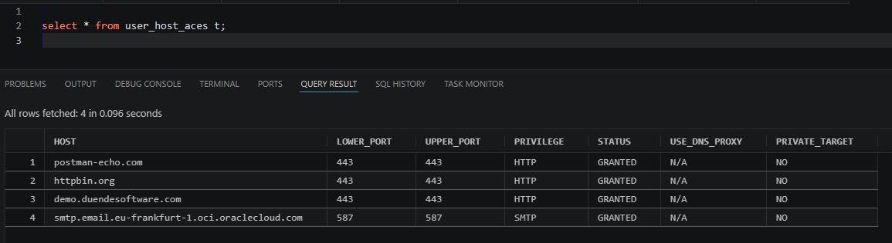

# Security and networking considerations

## Three different meanings of "ACL"

The lab touches three concepts that are easy to confuse.

### S3 object ACLs

The bucket is created with **ACLs disabled / Bucket owner enforced**. Access is controlled with IAM/bucket policies rather than per-object S3 ACLs.

### AWS IAM policy

The IAM policy defines what the AWS principal may do to the bucket and objects. It grants only the S3 operations required by the lab.

### Oracle network ACL / ACE

Oracle network ACLs control whether a database principal can make outbound network requests to a host. This is separate from AWS authorization.

## Why no explicit amazonaws.com ACE was needed here

The Autonomous Database used for this lab had existing host ACEs for other external endpoints but no explicit AWS/S3 host entry:



Nevertheless, `DBMS_CLOUD.LIST_OBJECTS` against the standard Amazon S3 endpoint succeeded.

Oracle documents a set of pre-configured object-store/REST endpoints for `DBMS_CLOUD`; additional customer-managed endpoints can require explicit network ACL enablement.

This result should therefore be phrased narrowly:

> In this Autonomous Database lab, the standard Amazon S3 endpoint worked through DBMS_CLOUD without adding an explicit S3 host ACE.

Do **not** generalize that statement to every database deployment. Private endpoints, customer-managed S3-compatible endpoints, VCN routing, NSGs, security lists, NAT/gateway configuration, or other outbound-network controls can change the requirements.

## Private S3 bucket

`Block all public access` remains enabled throughout the lab. The database does not need anonymous access; requests are signed using the AWS credential stored by `DBMS_CLOUD`.

## Credential hygiene

The public SQL contains placeholders only:

```text
<AWS_ACCESS_KEY_ID>
<AWS_SECRET_ACCESS_KEY>
```

## References

- Oracle DBMS_CLOUD endpoint management: https://docs.oracle.com/en/cloud/paas/autonomous-database/serverless/adbsb/dbms-cloud-endpoint.html
- Oracle S3 URI formats: https://docs.oracle.com/en-us/iaas/autonomous-database-serverless/doc/file-uri-formats.html
- Oracle AWS ARN access: https://docs.oracle.com/en-us/iaas/autonomous-database-serverless/doc/amazon-arn.html
- AWS Block Public Access: https://docs.aws.amazon.com/AmazonS3/latest/userguide/access-control-block-public-access.html
